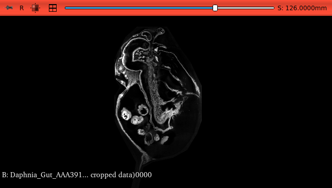

## MorphoDepot Repository
Repository for segmentation of a specimen scan.  See [this JSON file](MorphoDepotAccession.json) for specimen details.
* Species: Daphnia magna
* Modality: Micro CT (or synchrotron)
* Contrast: Yes
* Dimensions: (378, 750, 175)
* Spacing (mm): (1.0, 1.0, 1.0)

## Screenshots

